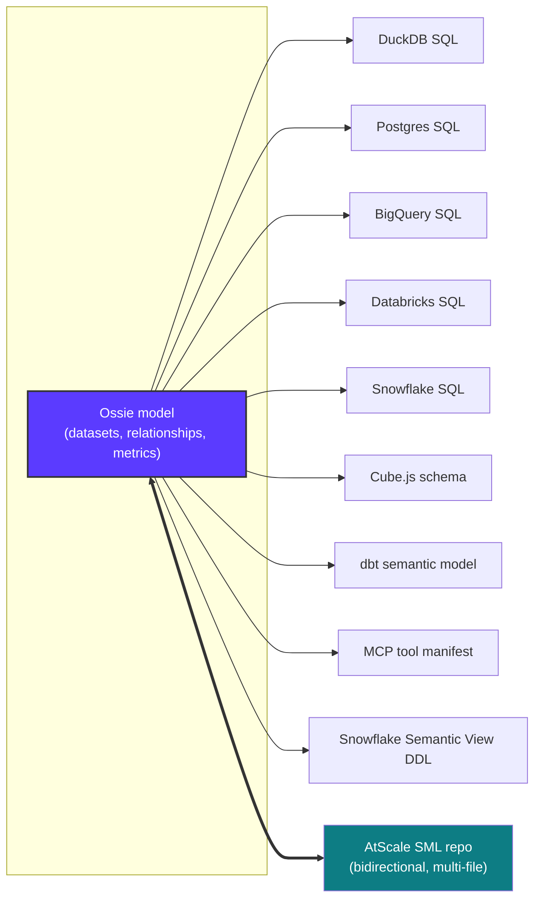
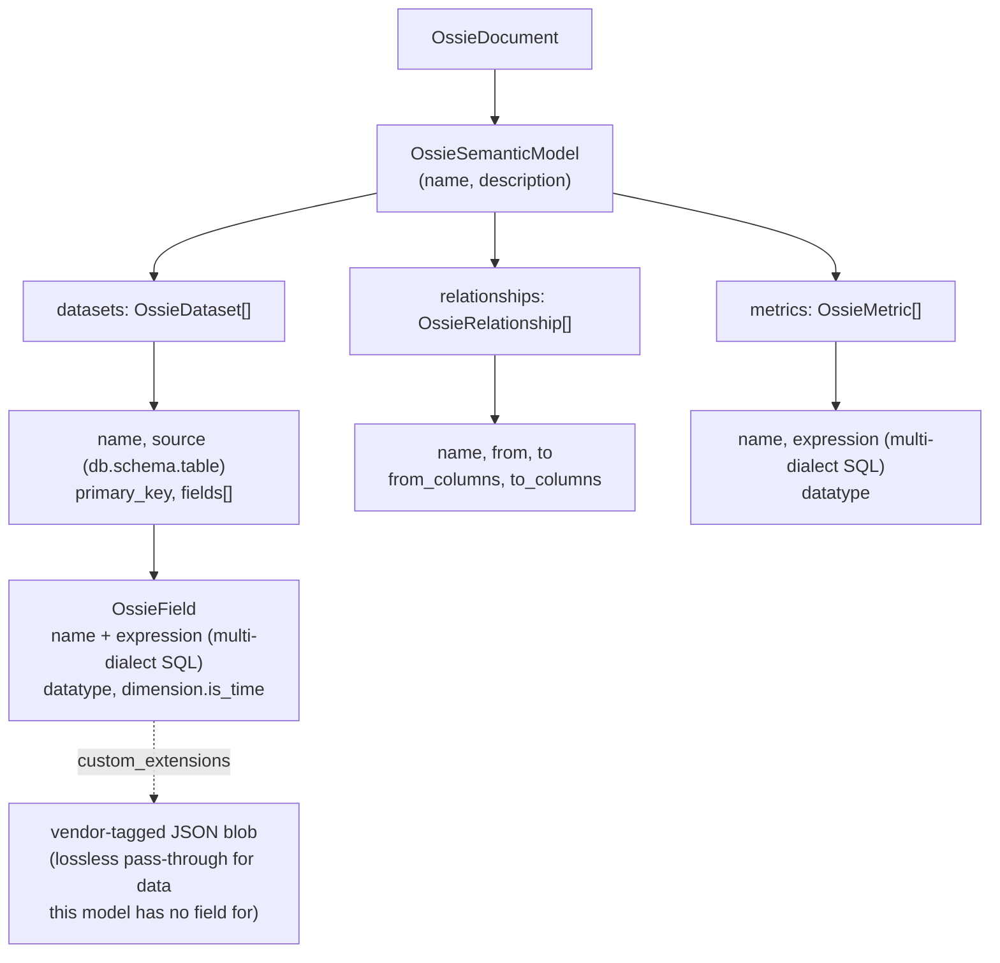
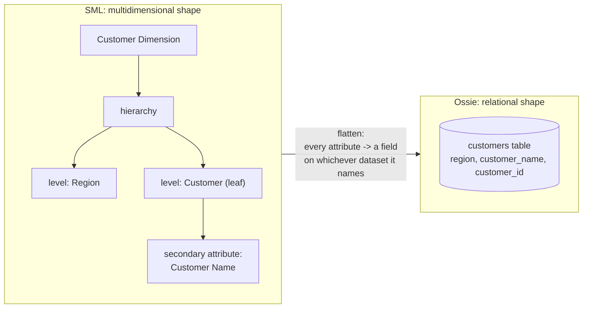
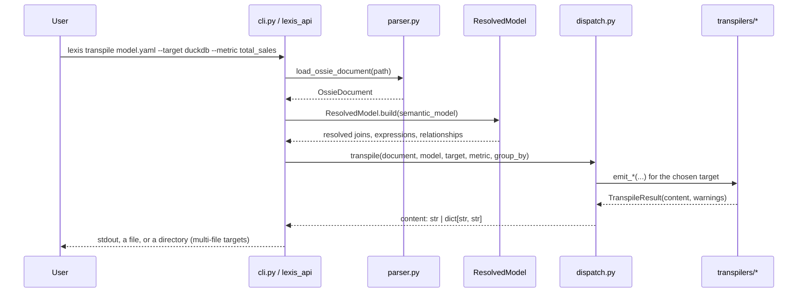
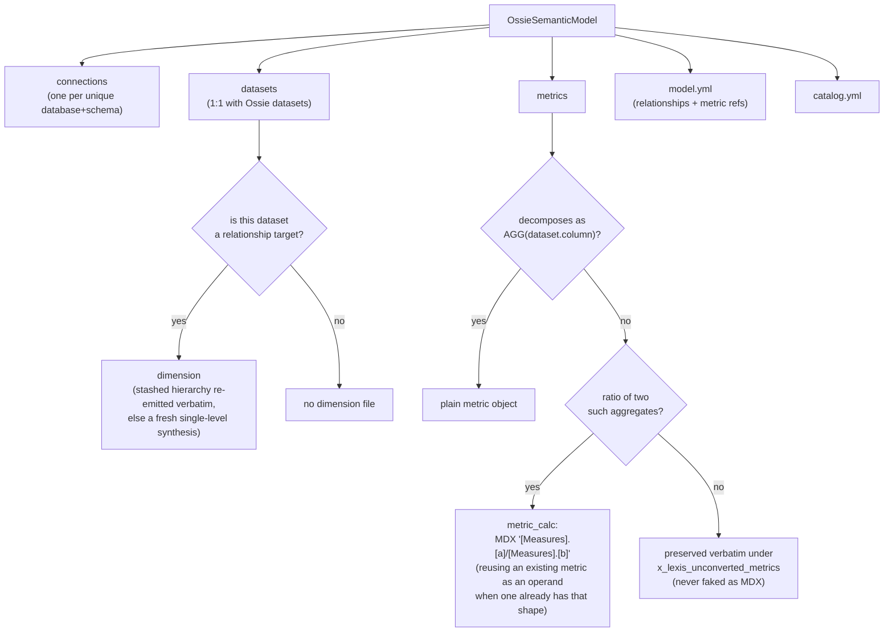
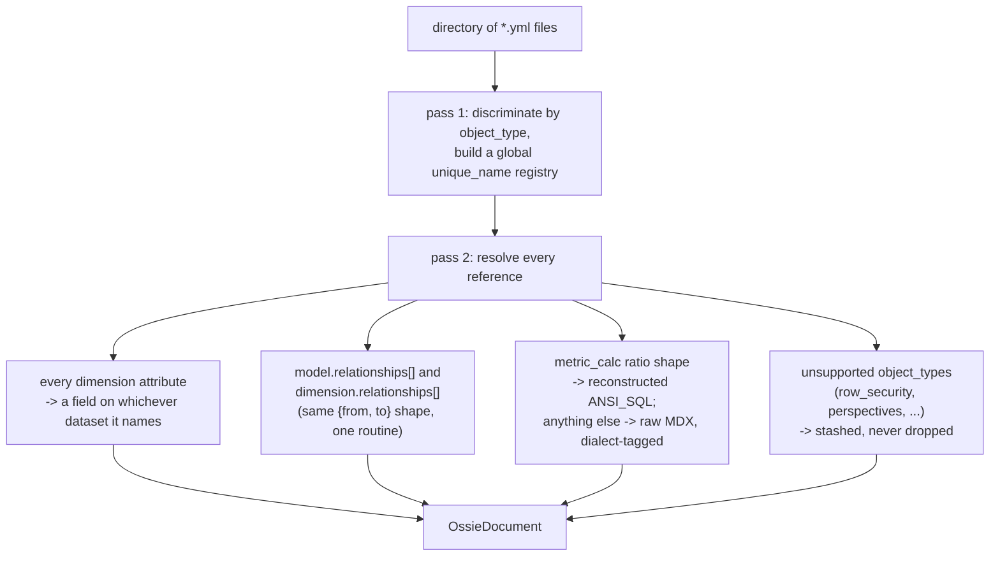
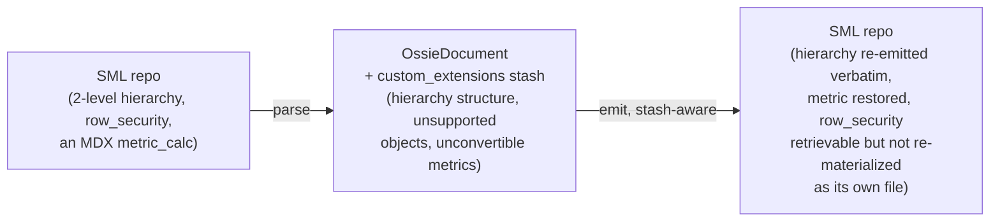
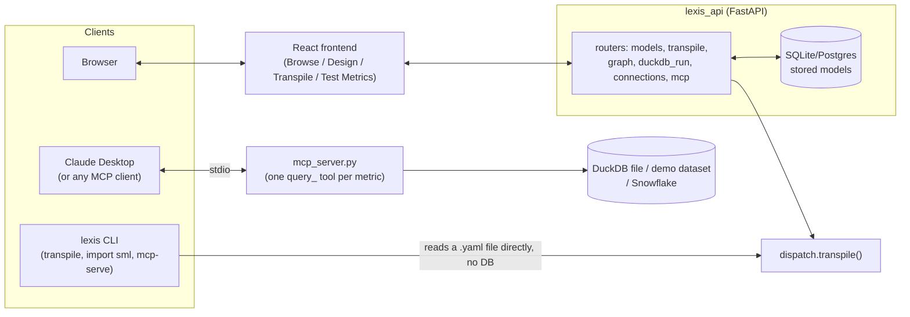

# How Lexis Works

Lexis manages one semantic model — datasets, relationships, metrics — written once in **Apache Ossie** YAML, and transpiles it into whatever a consumer actually needs: warehouse SQL, a Cube.js schema, dbt models, an MCP tool manifest, a Snowflake semantic view, or a full AtScale SML repo. This document walks through how that works, with diagrams.

---

## 1. The big idea: hub-and-spoke, not N×M

Without a hub format, supporting N warehouses and M consumer tools means authoring and maintaining N×M translators. Lexis instead has exactly one hub (Ossie) and N one-directional spokes:

Every spoke except **SML** is one-directional (Ossie → X) and produces a single file. SML is the one exception: it's a genuinely bidirectional, multi-file target, covered in detail in [§5](#5-sml-the-one-bidirectional-multi-file-target).

---

## 2. Anatomy of a model

An Ossie document is a flat, relational shape — no multidimensional concepts, no hierarchies. Just tables and the joins between them:

Every `expression` is **multi-dialect**: a field or metric can carry a different SQL string per warehouse (`ANSI_SQL`, `SNOWFLAKE`, `DATABRICKS`, ...), and each SQL transpiler picks its preferred dialect with an ANSI_SQL fallback.

---

## 3. Cubes vs. flat tables — why SML needs a real converter

SML models a **multidimensional cube**: dimensions have hierarchies, hierarchies have ordered levels, levels have key + secondary attributes. Ossie has none of that — just datasets and relationships. But this isn't a Lexis limitation: SQL warehouses have no native multidimensional storage either, so *any* cube ends up stored as flat relational tables (a star or snowflake schema) — that's the only way an OLAP engine on top of SQL can work at all.

Lexis's flattening rule: every dimension attribute — key or secondary — becomes a plain field on **whichever physical dataset that attribute itself names**. That's what makes a snowflaked dimension (levels backed by different tables) fall out for free, with no special-casing. What's lost in the flattening is purely the *grouping* metadata: level order, multiple hierarchies, calculation groups. Ossie has nowhere to put that — so it's preserved in a stash rather than silently dropped (more in §5).

What can **never** be recovered by rearranging tables, no matter how the cube is decomposed, is *query-engine interpretation logic* — MDX's "current member" / "previous period" navigation depends on which hierarchy level a query happens to be browsing at run time, so it has no fixed SQL form independent of the query's `GROUP BY`. That's a translation problem, not a storage-shape problem (see §5.3).

---

## 4. The transpile pipeline

Both the CLI and the web API funnel through the same shared dispatch logic:

`ResolvedModel` does the real work once, up front: resolving each field/metric's per-dialect expression, computing join paths between datasets via `relationships[]`, and answering "which datasets does this expression touch?" — every emitter builds on that instead of re-deriving it.

`dispatch.py`'s `TARGETS` list is the single source of truth for what `--target` accepts:

| Target | Kind | Output |
|---|---|---|
| `duckdb`, `postgres`, `bigquery`, `databricks`, `snowflake` | SQL | one `SELECT` per metric |
| `cube` | Cube.js schema | one YAML file |
| `dbt` | dbt semantic model | one YAML file |
| `mcp` | MCP tool manifest | one JSON file |
| `snowflake_semantic_view` (alias `ssv`) | DDL | one `CREATE SEMANTIC VIEW` statement |
| `sml` | AtScale SML repo | **one file per object** (`dict[str, str]`) |

---

## 5. SML: the one bidirectional, multi-file target

### 5.1 Ossie → SML (`emit.py`)

### 5.2 SML → Ossie (`parse.py`)

v1 requires exactly one `catalog` and one `model` object per repo (multi-model/composite SML repos are out of scope).

### 5.3 Why round trips need a stash

Every SQL/Cube/dbt/MCP target is one-directional, so there's nothing to preserve across a hop. SML is different — going there and back should not silently erase information Ossie has no field for:

Two concrete mechanisms make this work:

- **Dimension hierarchies**: `emit.py` checks for a stashed dimension shape before synthesizing a fresh single-level one, so a hand-authored multi-level hierarchy survives an SML → Ossie → SML round trip intact — including a *degenerate* dimension (keyed on a fact table's own column) that has no relationship to trigger it.
- **Unconvertible metrics**: a metric that's neither a simple aggregate nor a ratio of two can't become any real SML object (SML has no vendor-extension slot the way Ossie's `custom_extensions` is) — so it's preserved verbatim under a small, clearly-namespaced `x_lexis_unconverted_metrics` field on `model.yml`, restored on the way back (a real metric of the same name later added by hand wins over a stale stash entry).

What's *not* attempted: translating arbitrary hand-written MDX (time-intelligence calculations like `PrevMember`/YTD) into SQL. That's a closed-but-hard problem — SML's own `calculation_group`/named-template mechanism would be the tractable path there, versus parsing free-form MDX generally — and a wrong silent translation is worse than an honest pass-through.

---

## 6. Where it runs

The CLI is stateless — it reads a YAML file straight off disk. The web API persists models in a database and exposes the same `dispatch.transpile()` call behind `/api/models/{id}/transpile`; the frontend's Transpile tab renders single-file targets as plain text and the one multi-file target (`sml`) as a file-tree explorer.

---

## 7. Where to look next

| Question | File |
|---|---|
| "What targets exist and how do I add one?" | `src/lexis/dispatch.py` |
| "How does a field's SQL get resolved across dialects?" | `src/lexis/resolved_model.py` |
| "How does one SQL dialect differ from another?" | `src/lexis/transpilers/sql/*.py` |
| "How does the SML converter work in detail?" | `src/lexis/sml/`, `SML_OSSIE_CONVERTER_PLAN.md` |
| "How does the web app wire this up?" | `src/lexis_api/routers/transpile.py`, `frontend/src/components/TranspileView.tsx` |
